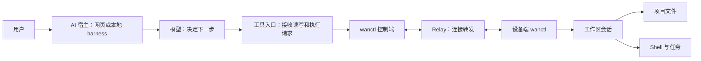

# 01｜全景：系统里有谁，各自负责什么

你想要的远程工作区，可以先理解成“AI 的工作地点”。AI 进入远端项目后，接下来读到的代码、修改的文件、执行测试用的依赖，都应属于这个地点。用户仍然在原来的聊天窗口里交流。

## 先看完整系统

模型负责决定“改哪个文件、运行什么测试”。宿主负责维持对话、调用工具、展示结果。wanctl 控制端把请求送往正确设备。Relay 解决跨网络到达问题。设备端决定是否允许操作，并访问真正的文件和进程。工作区会话把这些操作组织成一次连续的工作。

这些名字不意味着必须部署七个服务。工具入口和控制端可以在同一个进程里，工作区会话可以只是设备端内部管理的一条记录和一组进程。架构首先是在划分职责。

## 一次修改会经过什么

用户要求修复测试。模型读文件，提交修改，然后运行测试。前两步需要文件能力，第三步需要执行能力。三步都必须使用同一个工作区，才能避免“读的是远端代码，测试却跑在本机”。结果返回原来的聊天窗口。

这里最值得注意的是工作区绑定：谁负责记住当前设备和项目？如果每次都让模型重新填写，模型会一直处理远程细节。如果工具入口或宿主保存绑定，模型便可以持续使用同一个环境。

## 对照 VS Code Remote

VS Code 的本地界面和远端工作区各有职责。工作区相关扩展运行在远端，界面相关扩展留在本地。文件和运行环境靠近，用户通过本地界面操作它们。wanctl 借鉴的是这种责任分配；第一版不会因此自动拥有整个 IDE。

参考：[VS Code Remote 的扩展架构](https://code.visualstudio.com/api/advanced-topics/remote-extensions#architecture-and-extension-kinds)。

## 这一层要记住的关系

工作区是统一的工作地点，连接只是到达它的一条通道。模型、宿主、控制端和设备端围绕这个地点合作。下一篇讨论工具入口能控制哪些请求。
