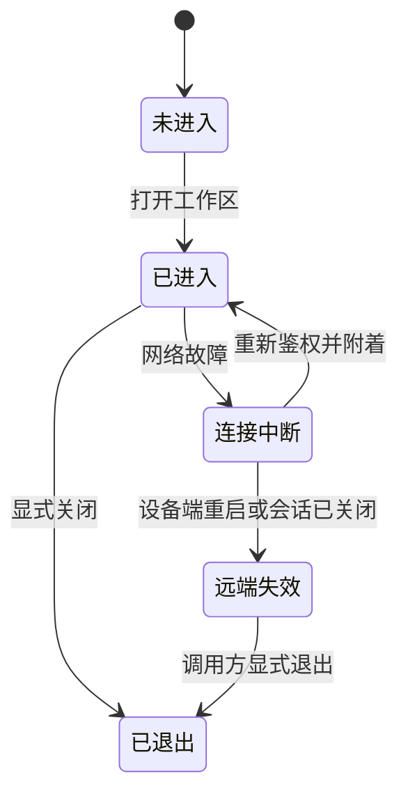

# 03｜状态：身份、工作区、连接和任务

系统设计里常见的困难，是几个都叫“会话”的东西实际上活得不一样久。远程工作区需要明确区分四个对象。

| 对象 | 回答的问题 | 什么时候结束 |
|---|---|---|
| 身份和授权 | 谁可以访问哪台设备 | 注销、撤销或到期 |
| 工作区 | 正在什么项目里做哪一次工作 | 显式关闭或设备端失效 |
| 网络连接 | 这次怎样传送请求和结果 | 请求结束或网络中断 |
| 执行任务 | 那条命令执行到哪里了 | 成功、失败、取消或期限到达 |

## 正常使用与短暂断网

连接中断并不证明工作结束。设备上的构建可能仍在继续。因此任务应由设备端工作区管理，客户端只订阅结果；重新连接后查询已有任务，而不是重新启动一次。

## Shell 为什么能保留目录和环境

在一个活着的 shell 里，当前目录和环境变量是该进程的状态。下一条命令交给同一个 shell，就可以沿用它们。不同工作区拥有不同 shell，便不会因为共用登录身份而互相污染。

这不表示所有程序的变量都会保留。每次启动一个新的 Python 程序，它仍然有自己的生命周期。持续运行的 Python REPL 或内核是工作区中另一种进程，后续可以单独支持。

## 持久到什么程度

第一版的目标是跨工具调用、跨网络连接保留状态。设备端进程退出或机器重启后，任意 shell 的内存不会自动复原。系统需要诚实地返回“工作区已失效”，不能新建一个空 shell 并假称原状态还在。

关闭一个终端，也不应自动把所有工具切回本地。工作区绑定由明确的退出动作结束。网络错误、程序错误和用户退出必须是不同事件。

下一篇把这些对象串进日常操作，观察一项任务怎样完成。
